<div align="center">

# Agentic Architectures

**Thirty-five production-grade agentic AI patterns, end to end.**

*A library and a living textbook. Real LLM outputs, provider-agnostic, deterministic-picker discipline, and a comparative benchmark leaderboard.*

[](https://github.com/FareedKhan-dev/all-agentic-architectures/actions/workflows/ci.yml)
[](https://fareedkhan-dev.github.io/all-agentic-architectures/)
[](https://pypi.org/project/agentic-architectures/)
[](https://pypi.org/project/agentic-architectures/)
[](LICENSE)
[](https://github.com/FareedKhan-dev/all-agentic-architectures/stargazers)

[**Documentation**](https://fareedkhan-dev.github.io/all-agentic-architectures/) &nbsp;·&nbsp;
[**Quickstart**](https://fareedkhan-dev.github.io/all-agentic-architectures/getting-started/quickstart/) &nbsp;·&nbsp;
[**Architectures**](https://fareedkhan-dev.github.io/all-agentic-architectures/architectures/) &nbsp;·&nbsp;
[**Benchmarks**](https://fareedkhan-dev.github.io/all-agentic-architectures/benchmarks/) &nbsp;·&nbsp;
[**Open in Codespaces**](https://codespaces.new/FareedKhan-dev/all-agentic-architectures)

</div>

---

## Overview

A single Python library that packages every major agentic AI pattern from the literature as a runnable `Architecture` class with a uniform contract. Each pattern ships with a fully executed Jupyter notebook whose theory is written *against* the captured run — not synthetic examples. The library is multi-provider (Nebius, OpenAI, Anthropic, Groq, Ollama, Together, Fireworks, Mistral, Google) and built on top of LangGraph state machines.

The central technical discipline of the repository is the **deterministic-picker pattern** — every LLM-as-Scorer surface has the LLM commit to categorical features (booleans, enums) and lets Python compose the deciding signal. This is the universal escape from the LLM-as-Scorer flat-band pathology and is applied in 13 of 35 architectures; 9 more are architecturally immune by design.

## Quickstart

```bash
pip install "agentic-architectures[nebius,faiss,tavily]"
```

```python
from agentic_architectures import get_llm
from agentic_architectures.architectures import Reflection

arch = Reflection(llm=get_llm(), max_iterations=2, target_score=8)
result = arch.run("Write a haiku about a glacier.")

print(result.output)
print("score:", result.metadata["final_score"], "/ 10")
```

Same `.run(task)` interface across all 35 architectures. Same `ArchitectureResult` return shape. Swap the class, swap the pattern — your downstream code does not change.

<details>
<summary><b>Set up a virtualenv from a fresh clone</b></summary>

```bash
git clone https://github.com/FareedKhan-dev/all-agentic-architectures
cd all-agentic-architectures

python -m venv .venv
.venv\Scripts\activate              # Windows
source .venv/bin/activate           # macOS / Linux

pip install -e ".[dev,test,docs,nebius,faiss,tavily,networkx]"
cp .env.example .env                # then fill in NEBIUS_API_KEY etc.

pytest -q                           # 283 tests pass in ~30s
```

</details>

## Library layout

```mermaid
flowchart LR
    subgraph core [Core abstractions]
        A1[Architecture ABC]
        A2[ArchitectureResult]
        A3[get_llm factory]
        A4[LLMJudge]
    end

    subgraph patterns [35 architectures]
        P1[Reasoning &amp; Reflection]
        P2[Sampling &amp; Search]
        P3[Retrieval RAG]
        P4[Memory]
        P5[Tools &amp; Actions]
        P6[Multi-Agent]
        P7[Safety &amp; Routing]
        P8[Specialty]
    end

    subgraph infra [Memory + Tools]
        M1[VectorMemory<br/>FAISS / Chroma / Qdrant]
        M2[SemanticMemory<br/>NetworkX / Neo4j]
        M3[EpisodicMemory]
        T1[web_search_tool<br/>Tavily]
        T2[python_repl_tool]
        T3[SimulatorTool]
    end

    core --> patterns
    patterns --> infra
```



## The 35 architectures

### Reasoning & Reflection

| Architecture | Pattern | Reference |
|---|---|---|
| **Reflection** | Generate → critique → refine | Madaan 2023 |
| **Reflexion** | Verbal reflections in episodic memory | Shinn 2023 |
| **Chain-of-Verification (CoVe)** | Verify each baseline claim independently | Dhuliawala 2023 |
| **Self-Discover** | SELECT → ADAPT → IMPLEMENT → SOLVE | Zhou 2024 |
| **Constitutional AI** | Per-rule pass/fail → revise | Bai 2022 |

### Sampling & Search

| Architecture | Pattern | Reference |
|---|---|---|
| **Self-Consistency** | Sample N paths, majority-vote | Wang 2022 |
| **Tree of Thoughts** | Beam search over thoughts | Yao 2023 |
| **LATS** | MCTS tree with reward backup | Zhou 2024 |
| **Mental Loop** | Simulate → score (deterministic-picker) | this repo |
| **Ensemble** | N voters, weighted aggregation | this repo |

### Retrieval (RAG)

| Architecture | Pattern | Reference |
|---|---|---|
| **Agentic RAG** | Agent decides when & what to retrieve | LangGraph reference |
| **Corrective RAG (CRAG)** | Grade docs, fall back to web | Yan 2024 |
| **Self-RAG** | Per-doc reflection tokens | Asai 2024 |
| **Adaptive RAG** | Pre-route by query complexity | Jeong 2024 |
| **GraphRAG** | KG + community summaries | Microsoft 2024 |

### Memory

| Architecture | Stored unit | Reference |
|---|---|---|
| **Episodic + Semantic** | Conversation turns + triples | Park 2023 |
| **Graph Memory** | (subject, predicate, object) triples | this repo |
| **MemGPT** | OS-style context + archival tiers | Packer 2023 |
| **Voyager** | Reusable Python skills (real subprocess) | Wang 2023 |
| **Agent Workflow Memory** | High-level workflow recipes | Wang 2024 |

### Tools & Actions

| Architecture | Pattern | Reference |
|---|---|---|
| **Tool Use** | Agent with one tool | LangChain reference |
| **ReAct** | Thought → Action → Observation | Yao 2022 |
| **Planning** | Decompose → execute → replan | Wei 2022 |
| **Plan-Execute-Verify (PEV)** | Post-execution verification per step | this repo |
| **SWE-Agent** | Sandboxed file-system agent | Yang 2024 |
| **BrowserAgent** | Real Playwright + safety gate | Anthropic Computer-Use 2024 |

### Multi-Agent

| Architecture | Pattern | Reference |
|---|---|---|
| **Multi-Agent** | Supervisor + specialists | LangGraph reference |
| **Blackboard** | Shared workspace + agents | classical AI |
| **Debate** | N agents × K rounds | Du 2023 |
| **STORM** | Multi-perspective research → article | Shao 2024 |
| **Meta-Controller** | Router over architectures | this repo |

### Safety & Routing

| Architecture | Pattern | Reference |
|---|---|---|
| **Dry-Run** | Propose → simulate → approval gate | this repo |
| **Reflexive Metacognitive** | Self-aware capability routing | this repo |

### Specialty

| Architecture | Pattern | Reference |
|---|---|---|
| **RLHF Self-Improvement** | Multi-dim deterministic scoring + archive | this repo |
| **Cellular Automata** | LLM rules over a grid | this repo |

## Provider compatibility

| Provider | Install extra | Default model used in this repo |
|---|---|---|
| **Nebius** (default) | `[nebius]` | `meta-llama/Llama-3.3-70B-Instruct` + `Qwen/Qwen3-235B-A22B-Thinking-2507-fast` |
| OpenAI | `[openai]` | any `gpt-*` |
| Anthropic | `[anthropic]` | any `claude-*` |
| Groq | `[groq]` | any of their hosted models |
| Ollama (local) | `[ollama]` | `llama3.3:70b` recommended |
| Together | `[together]` | any of their hosted models |
| Fireworks | `[fireworks]` | function-calling models |
| Mistral | `[mistral]` | EU-hosted option |
| Google | `[google]` | Gemini 2.x via Generative AI API |

Switch via `LLM_PROVIDER` + the corresponding key in `.env`. No code changes.

## Benchmarks

A 17-task benchmark suite runs every architecture and scores results. Most recent run, real Nebius Llama-3.3-70B (~25 min, ~$1.50 in tokens):

| Score band | Architectures |
|---|---|
| **Strong** | Reflection (3/3), SelfConsistency (2/2), SelfDiscover (2/2), BrowserAgent (2/2), and 21 more 1/1 |
| **Pattern-fit failures** | LATS on math (search-shaped pattern, not arithmetic), Debate + Ensemble on trick logic (group-think), Reflexion + AWM on stateful recall (wrong memory shape) |
| **Total** | **33 / 42 correct (78%)** |

Full leaderboard with per-task answer excerpts: [docs.../benchmarks/](https://fareedkhan-dev.github.io/all-agentic-architectures/benchmarks/)

## Learning paths

Four curated reading orders, depending on what you're trying to do:

| Path | For | Notebooks in order |
|---|---|---|
| **Beginner** | Mental model of how an agent is structured | Reflection → Tool Use → ReAct → Planning → Self-Consistency |
| **RAG-focused** | Production retrieval pipelines | Agentic RAG → CRAG → Self-RAG → Adaptive RAG → GraphRAG |
| **Multi-agent** | Coordinating multiple specialists | Multi-Agent → Blackboard → Debate → STORM → Meta-Controller |
| **Safety** | Pre/post-execution guardrails | Dry-Run → Constitutional AI → Reflexive Metacognitive → BrowserAgent (safety gate) |

## Documentation

- **Full site**: [fareedkhan-dev.github.io/all-agentic-architectures](https://fareedkhan-dev.github.io/all-agentic-architectures/)
- **Quickstart**: [getting-started/quickstart](https://fareedkhan-dev.github.io/all-agentic-architectures/getting-started/quickstart/)
- **Add your own architecture** (5-step recipe): [tutorials/adding-your-own](https://fareedkhan-dev.github.io/all-agentic-architectures/tutorials/adding-your-own/)
- **The deterministic-picker pattern** (the central technical pattern): [tutorials/deterministic-picker](https://fareedkhan-dev.github.io/all-agentic-architectures/tutorials/deterministic-picker/)
- **Memory comparison** (all 7 variants): [tutorials/memory](https://fareedkhan-dev.github.io/all-agentic-architectures/tutorials/memory/)
- **Auto-generated API reference**: [reference/](https://fareedkhan-dev.github.io/all-agentic-architectures/reference/)

## What's tested

```
pytest -q
283 passed, 37 skipped (env-gated integration), 1 warning in ~30s
```

| Suite | Coverage |
|---|---|
| Registry sweep | All 35 architectures (metadata + instantiate + build) |
| Pure-Python helpers | Haiku checker, composite scorers, subprocess executor, safety gate, sandbox path |
| Notebook integrity | All 35 notebooks executed, no error outputs, §9 commentary tailored from real captured runs |
| Integration | One real-LLM happy-path per architecture, env-gated via `RUN_INTEGRATION=1` |

## Contributing

Contributions welcome. Two paths:

1. **Add a new architecture** — follow the [5-step recipe](https://fareedkhan-dev.github.io/all-agentic-architectures/tutorials/adding-your-own/). The PR template includes a deterministic-picker checklist.
2. **Improve an existing one** — bug fix, prompt tuning, performance, scoring rubric. Open an issue first to discuss scope.

See [CONTRIBUTING.md](CONTRIBUTING.md) for the dev setup, code style, and commit-message convention (Conventional Commits — `release-please` auto-generates the CHANGELOG).

## Citation

If you use this work in research or production tooling, please cite:

```bibtex
@misc{khan2026agentic,
  title         = {Agentic Architectures: A Library of 35 Production-Grade Agentic AI Patterns},
  author        = {Khan, Fareed},
  year          = {2026},
  howpublished  = {\url{https://github.com/FareedKhan-dev/all-agentic-architectures}},
  note          = {MIT licensed Python library and runnable textbook}
}
```

## License

[MIT](LICENSE) — © 2026 Fareed Khan.

---

<div align="center">

<sub>
Built on <a href="https://langchain-ai.github.io/langgraph/">LangGraph</a> ·
Docs powered by <a href="https://squidfunk.github.io/mkdocs-material/">Material for MkDocs</a> ·
Default LLM via <a href="https://nebius.com/">Nebius</a>
</sub>

</div>
